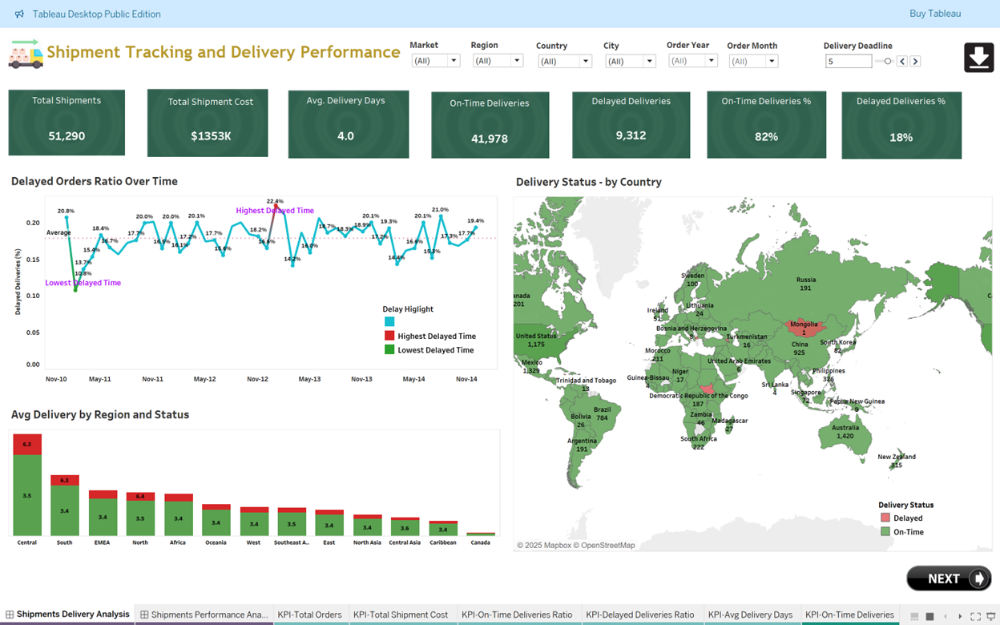

# Global Super Store - Shipment Analysis
Global Super Store - Shipment Analysis
Global Superstore Dashboards
1.	Shipments Delivery Analysis
 
a. Key Visualizations
    1.	KPI Tiles (Top Row): Highlight key performance indicators and summary statistics.
    2.	Line Chart - Delayed Orders Ratio Over Time: Illustrates the monthly trend of delayed delivery ratios, with annotations marking the highest and lowest points.
    3.	Map - Delivery Status by Country: Depicts global delivery performance, using color coding to differentiate between on-time and delayed shipments.
    4.	Bar Chart - Average Delivery Time by Region and Status: Shows a regional comparison of average delivery days, distinguishing on-time deliveries (green) from delayed ones (red).
    5.	Filters, Parameters and Conditional highlighting, Navigation features enable dashboards interactive.
b. Interpretation
    1.	From KPI: 82% of shipments are on time, which is good, but nearly 1 in 5 are delayed, which is an area for improvement. The 4-day average delivery time is reasonable but could be shortened to boost competitiveness.
    2.	From Line Chart: Delivery performance fluctuates, with delay spikes likely due to seasonal or operational factors. The highest delay (24%) was in Mar-13, and the lowest (~12%) in Nov-13 and Mar-11.
    3.	From Map: Delivery performance varies by region, with China facing significant delays, possibly due to logistics or supplier issues.
    4.	From Bar Graph: Central and South regions face longer delays, while EMEA and North America show more consistent, efficient delivery performance.
    c. Strategic Recommendations
    1.	Optimize High-Delay Regions: China and Central region should be prioritized for operational review. Investigate supplier performance, last-mile logistics, customs/border delays and check for alternative vendors.
    2.	Predict and Prevent Delays: Analyze historical spikes (e.g., March & July) for root causes and adjust inventory and logistics capacity with forecasted demand and utilize predictive analytics to flag high-risk shipments.
    3.	Improve Delivery Standards: Reduce the average delivery time from 4.0 to under 3.5 days to enhance customer satisfaction.
    4.	Customer Communication: Proactively notify customers in high-delay zones of potential shipment issues. Offer incentives for flexible delivery timelines in delay-prone regions.

2.	Shipments Performance Analysis

 
a. Key Visualizations
    1. Shipments by Priority (Heatmap Table): Provides orders counts from different markets against different shipment priorities.
    2. Shipment Priority vs Avg Shipping Days and Cost (Pie Chart): Provides average delivery days against each shipment priority and associated average shipping cost.
    3. Shipments Delivery Status by Market (Donut Charts): Provides Shipment performance in different Markets.	
    b. Interpretation
    1.	For Heat Map: Most shipments are Medium priority (57%), with few Critical orders (6.6%), likely reserved for urgent needs. APAC handles the highest volume across all priority levels.
    2.	From Pie-Chart: Critical shipments are fastest (1.8 days) but costliest. Low priority is slowest (6.5 days) and oddly costlier than Medium, which is the most cost-efficient.
    3.	From Donut Chart: Canada leads in on-time delivery (65%) but has low volume. LATAM and EU have the highest delays (~41%). No region exceeds 66% on-time-a key concern.

c. Strategic Recommendations
    1. Focus on Improving On-Time Deliveries: With on-time rates below 65%, improvement is needed, especially in LATAM and EU (delays >40%). Focus on predictive ETAs, stronger vendor SLAs, carrier accountability, and root cause analysis of warehouse or customs delays.
    2. Rethink Low Priority Logistics: Low-priority shipments take 6.5 days and cost more than medium, indicating inefficiencies. Audit partners, check for costly delays or re-routing, and consolidate loads to optimize.
    3. Balance Cost and Speed for High-Critical Orders: Critical orders are costly but fast, suitable for urgent needs. High-priority makes up 30%, so avoid overuse by adding justification controls for high-cost shipments.
    4. Regional Strategy Tailoring: APAC handles the highest volume and needs sustainable scaling with more warehouse automation and supplier collaboration. Canada, with the best delivery rates, should be a benchmark for other regions.
